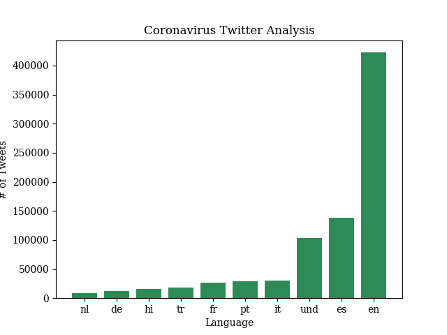

# Coronavirus twitter analysis

The goal of this project is to scan all geotagged tweets sent in 2020 to monitor for the spread of the coronavirus on social media. For this project, I will use the mapreduce method and the matplotlib library to create data visualizations about coronavirus hashtags on Twitter in 2020.

**Learning Objectives:**

1. work with large scale datasets
1. work with multilingual text
1. use the MapReduce divide-and-conquer paradigm to create parallel code

## Process

**Mapping, Reducing, and Visualizing:**

The `map.py` file processes the zip file for an individual day. Based on either language or country, it can count the number of times a certain hashtag was used that day. By running the following: 
```
$ ./src/map.py --input_path=/data/Twitter\ dataset/geoTwitter20-02-16.zip
```
You can create a folder `outputs` that contains a file `/geoTwitter20-02-16.zip.lang`.
This is a file that contains JSON formatted information summarizing the tweets from 16 February.

To loop the command over and over, use `run_maps.sh`. This will allow you to loop over each day/file in the dataset. By running the following: 
```
$ nohup sh run_maps.sh &
```
You run `map.py` for all the days in 2020.

To combine all of these outputs, which are stored in the `outputs` folder, use the `reduce.py` file. 
By running the following:
```
$ python3 ./src/reduce.py --input_paths outputs/geoTwitter20-*.lang --output_path=reduced.lang
```
You can combine all of the outputs generated by `map.py` so that these combined files can be visualized. 
This creates one file will all of the hashtag usage data, based on language, for 2020. 
If you wanted one based on country, run the following:
```
$ python3 ./src/reduce.py --input_paths outputs/geoTwitter20-*.country --output_path=reduced.country
```

Finally, with all the data processed, use the `matplotlib` library to create your data visualizations. It takes in `--input_path` and `--key` as inputs, then creates a graph to your specifications. 
By running the following:
```
$ ./src/visualize.py --input_path=reduced.lang --key='#coronavirus'
```
You can create a bar chart of the number of tweets that used #coronavirus for the top 10 languages.

I'm a big fan of making things pretty, so I tried to use `seaborn`, a Python visualization library based on `matplotlib`, to make everything prettier. You can find documentation for it here: [seaborn github repo](https://github.com/mwaskom/seaborn).
Unfortuately, I was unsuccessful, so I settled for making the font nice and the colors green.

## Outputs
**#coronavirus in 2020 by Language**
```
$ python3 ./src/visualize.py --input_path=reduced.lang --key='#coronavirus'
```


**#coronavirus in 2020 by Country**
```
$ python3 ./src/visualize.py --input_path=reduced.country --key='#coronavirus'
```


**#코로나바이러 in 2020 by Language**
```
$ python3 ./src/visualize.py --input_path=reduced.lang --key='#코로나바이러스'
```


**#코로나바이러 in 2020 by Country**
```
$ python3 ./src/visualize.py --input_path=reduced.country --key='#코로나바이러스'
```


### Alternative Reduce
`alternative_reduce.py` combines `reduce.py` and `visualize.py` to make graphs like the following:
**#covid19 #flu in 2020**
```
$ python3 ./src/alternative_reduce.py --keys '#covid19' '#flu'
```


**#hospital #nurse in 2020**
```
$ python3 ./src/alternative_reduce.py --keys '#hospital' '#nurse'
```

